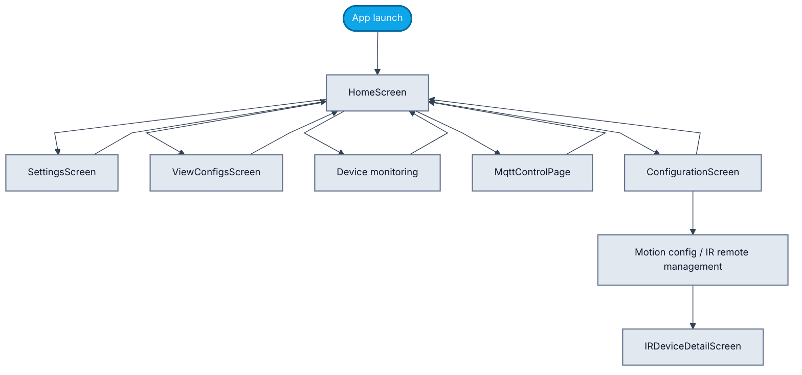
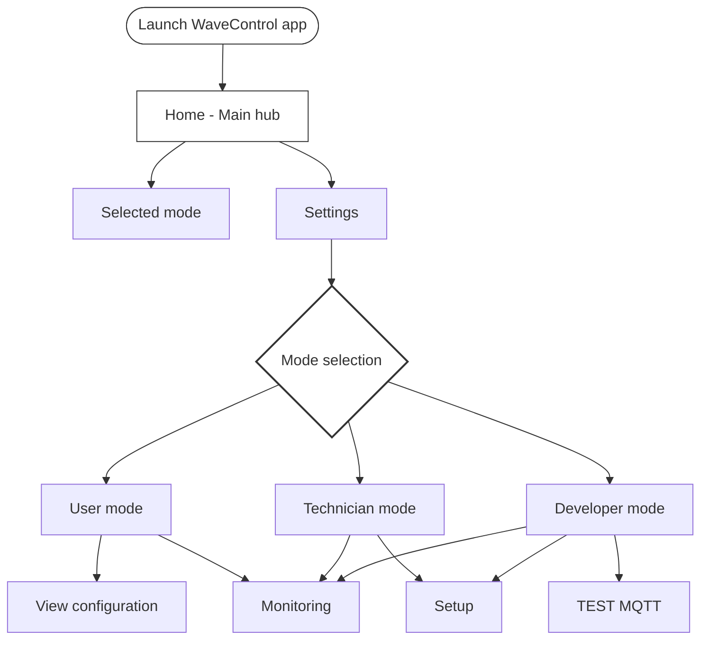
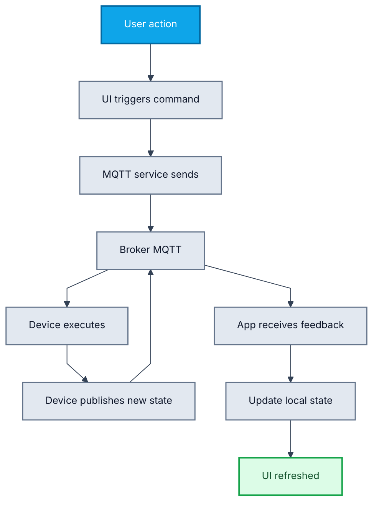
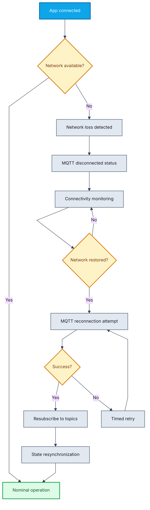
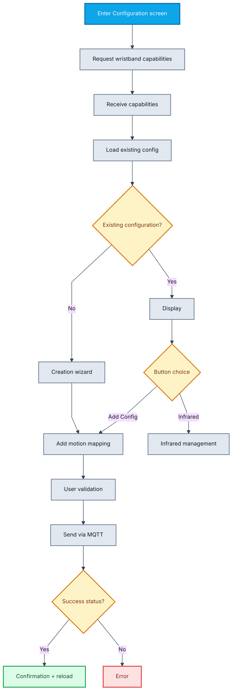
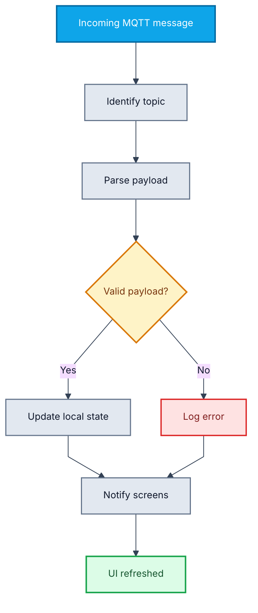
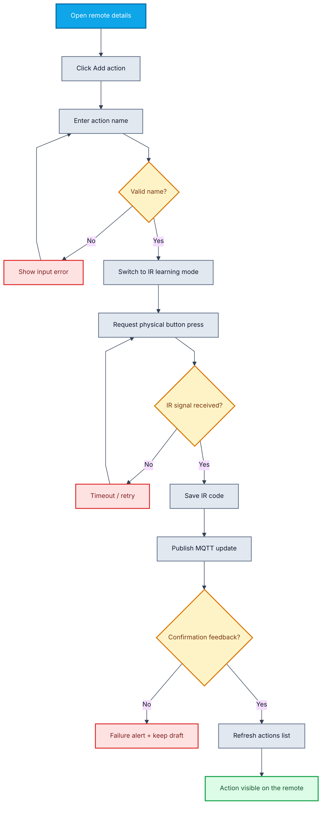
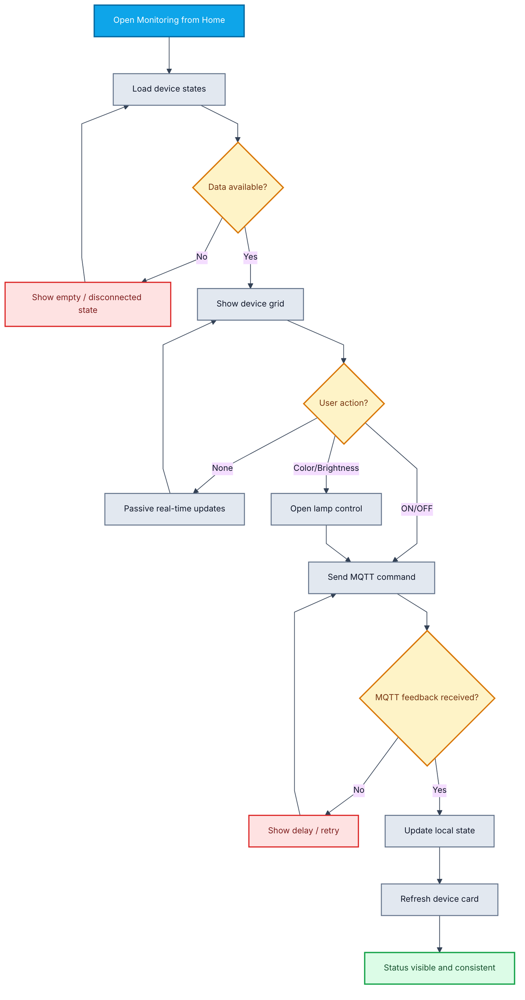
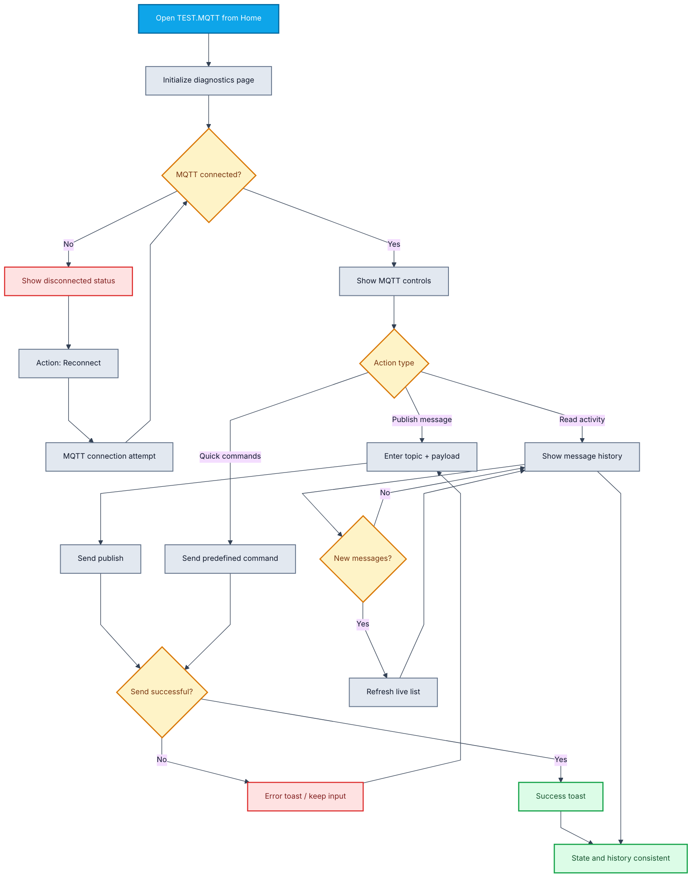

# WaveControl Flowcharts (Mermaid)

This document groups all project flowcharts using Mermaid `flowchart` syntax, for direct use in Mermaid-compatible tools.

To improve visual readability, each flowchart uses:
- increased spacing between nodes,
- a consistent palette (start/end, action, decision, result),
- branch structuring that avoids overlapping labels.

---

## 0) High-level app navigation



---


## 1) Global navigation and startup



---

## 2) Full MQTT command flow



---

## 3) Network reconnection



---


## 5) Wristband configuration workflow



---


## 6) Incoming message processing



---

## 7) Workflow for adding an action to an IR remote



```
## 10) Monitoring workflow



---

## 11) TEST.MQTT workflow



---