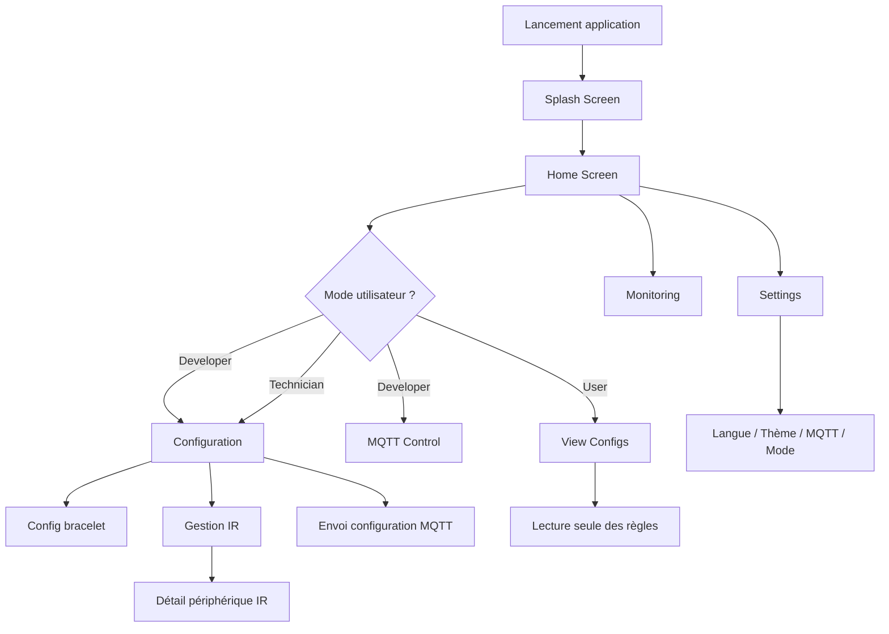
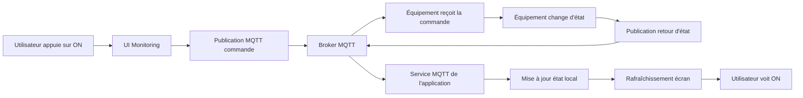
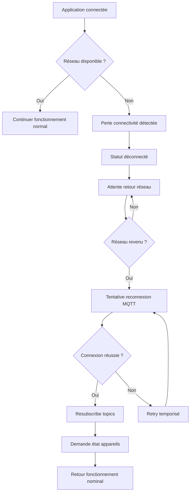
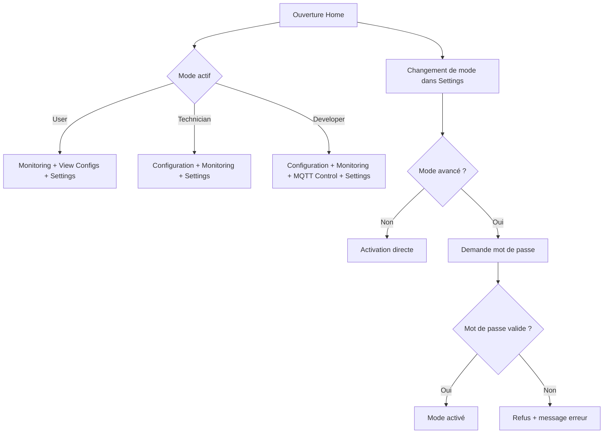
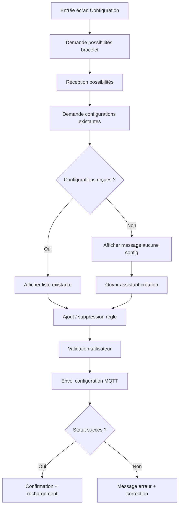
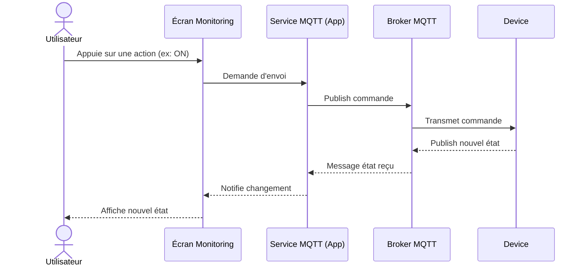

# Rapport technique détaillé – Application WaveControl

**Projet :** WaveControl  
**Date :** 25 février 2026  
**Auteur du rapport :** Équipe projet

---

## Résumé exécutif

WaveControl est une application mobile construite avec Flutter. Son rôle est de piloter et superviser des objets connectés (lumières, prises, périphériques IR, bracelet connecté) à travers un protocole de communication appelé MQTT.  

L’objectif principal du projet est de proposer une interface simple pour l’utilisateur final, tout en conservant des fonctions avancées pour les profils techniques (technicien et développeur). L’application est organisée autour d’un écran principal qui distribue les fonctionnalités selon le niveau d’accès.

Ce rapport explique :
- le but du projet,
- l’architecture globale,
- l’organisation des pages,
- le parcours utilisateur,
- les échanges de données,
- les choix techniques,
- les limites actuelles,
- et les pistes d’amélioration.

## 1. Contexte et problématique

Dans un environnement domotique, plusieurs appareils peuvent être pilotés à distance : éclairage, prises intelligentes, télécommandes IR, etc. Sans application centrale, l’utilisateur se retrouve souvent avec plusieurs interfaces et peu de visibilité sur l’état global du système.

WaveControl répond à cette problématique en proposant :
1. une **interface unifiée**,
2. un **pilotage en temps réel**,
3. une **configuration des interactions via un bracelet connecté**,
4. une **gestion par profils utilisateurs**.

En pratique, l’application sert à faire le lien entre l’utilisateur et les équipements en s’appuyant sur MQTT comme canal de communication.

On peut donc résumer la problématique ainsi : sans orchestration centrale, le système est difficile à exploiter ; avec WaveControl, l’utilisateur retrouve une logique unique de pilotage.

---

## 2. Objectifs du projet

### 2.1 Objectif fonctionnel
Permettre à un utilisateur de :
- visualiser les appareils disponibles,
- connaître leur état (allumé/éteint, niveau, couleur, etc.),
- déclencher des actions,
- configurer des comportements associés à des gestes du bracelet,
- gérer des périphériques infrarouges,
- et adapter l’application à son rôle.

Ces objectifs fonctionnels correspondent à des actions concrètes que l’on retrouve dans les écrans de l’application (surveiller, configurer, tester, valider).

### 2.2 Objectif technique
Mettre en place une application mobile qui :
- reste réactive,
- gère des flux temps réel,
- est stable malgré les pertes réseau,
- sépare correctement la logique métier de l’interface,
- et permet une maintenance évolutive.

En termes simples : l’application doit rester compréhensible et fiable aujourd’hui, tout en pouvant évoluer demain sans devoir tout reconstruire.

### 2.3 Objectif pédagogique (école)
Montrer une démarche d’ingénierie complète :
- conception de l’expérience utilisateur,
- implémentation logicielle,
- gestion des communications réseau,
- structuration d’un projet Flutter,
- et documentation technique claire.

---

## 3. Public cible et modes d’utilisation

L’application définit trois modes d’utilisation :

### 3.1 Mode Utilisateur
Profil non technique.  
Il a accès principalement à la supervision et à la consultation des informations nécessaires au quotidien.

### 3.2 Mode Technicien
Profil intermédiaire.  
Il peut configurer les interactions, effectuer des réglages opérationnels et diagnostiquer les comportements de base.

### 3.3 Mode Développeur
Profil avancé.  
Il dispose d’un accès étendu, notamment aux outils de test MQTT et à la totalité des fonctions de configuration.

Cette séparation réduit les erreurs de manipulation : un utilisateur standard ne voit pas des options complexes qui pourraient dégrader le fonctionnement.

Le choix des trois modes est donc autant une décision ergonomique qu’une décision de sécurité opérationnelle.

---

## 4. Vision globale de l’architecture

L’architecture peut se comprendre comme deux couches principales :

1. **Couche Interface (UI)**  
   Les écrans, les boutons, les vues de statut, les dialogues.

2. **Couche Service (logique et communication)**  
   Gestion des paramètres, connexion MQTT, réception/envoi des messages, conservation des états.

### 4.1 Principe central
- L’interface affiche des données et déclenche des actions.
- Les services gèrent la communication réelle avec les équipements.
- Les écrans se mettent à jour quand les services notifient un changement.

Ce découplage est important : il rend le projet plus robuste et plus facile à maintenir.

Pour un lecteur débutant, on peut voir cela comme une équipe à deux rôles :
- l’interface « discute » avec l’utilisateur,
- les services « discutent » avec les équipements.

Chacun a sa responsabilité, ce qui évite de mélanger les sujets.

---

## 5. Technologies utilisées

### 5.1 Flutter / Dart
Flutter permet de développer une application mobile multiplateforme avec une seule base de code.

### 5.2 MQTT
MQTT est un protocole léger de publication/abonnement, très utilisé en IoT.  
Idée simple :
- un appareil publie des messages sur un sujet (topic),
- les clients abonnés à ce sujet reçoivent les messages.

Ce modèle est particulièrement adapté à la domotique, car il permet d’échanger de petits messages rapidement, avec une charge réseau faible.

### 5.3 SharedPreferences
Stockage local léger pour conserver les réglages (thème, langue, mode, configuration réseau).

### 5.4 Connectivité réseau
La connectivité est surveillée pour tenter des reconnexions automatiques en cas de coupure.

### 5.5 Justification des outils et de l'environnement de développement

Le choix technologique principal s'est porté sur **Flutter/Dart** pour une raison opérationnelle majeure : livrer une application mobile sur **iOS et Android** avec une base de code unique. Dans le contexte du projet, cette approche réduit fortement le temps de développement et de maintenance par rapport à deux applications natives séparées.

L'environnement de développement retenu est **Visual Studio Code**, principalement pour son intégration fluide avec les outils Flutter et pour l'usage de **GitHub Copilot**. Ce choix est directement lié au contexte de réalisation : le langage Dart n'était pas maîtrisé au départ, et la durée du projet (3 mois) imposait un rythme rapide.

L'utilisation de Copilot a apporté trois bénéfices concrets :
- accélération de la production de code sur des tâches répétitives,
- assistance sur la syntaxe Dart/Flutter pendant la phase d'apprentissage,
- amélioration de l'efficacité globale dans un délai contraint.

En résumé, le binôme **VS Code + Copilot** a permis de maintenir un niveau de qualité satisfaisant tout en respectant les contraintes de temps et la montée en compétence sur une stack nouvelle.

---

## 5 bis. Rôle fonctionnel de l'application

WaveControl joue un rôle de **centre de contrôle** entre l'utilisateur et la base station. L'application couvre quatre fonctions principales :

1. **Configurer la base station** (paramètres réseau, mode d'usage, comportement applicatif),
2. **Ajouter et modifier des configurations** (notamment les associations geste → action du bracelet),
3. **Gérer les télécommandes IR** (ajout, suppression, consultation et détail des actions),
4. **Monitorer et piloter le système** en temps réel (états des appareils et commandes).

Cette combinaison fait de l'application un point unique de supervision, de configuration et d'exploitation opérationnelle.

---

## 6. Démarrage de l’application (cycle d’initialisation)

Le démarrage suit une séquence claire :

1. Initialisation Flutter et verrouillage de l’orientation.
2. Chargement des paramètres utilisateur (langue, thème, mode, MQTT).
3. Affichage du Splash Screen (transition visuelle).
4. Navigation automatique vers Home.
5. Tentative de connexion MQTT dès le lancement.
6. Première requête vers les appareils pour récupérer un état initial.

Pourquoi c’est important : cette stratégie évite de présenter un écran vide. L’application arrive rapidement avec des données déjà en cours de chargement.

Pour l’utilisateur, cela se traduit par une expérience plus fluide : l’application semble « prête » dès les premières secondes.

---

## 7. Articulation des pages (workflow de navigation)

## 7.1 Splash Screen
Rôle : accueil visuel et transition.  
L’utilisateur ne fait aucune action ici ; la navigation est automatique vers Home.

## 7.2 Home Screen (hub principal)
C’est la page centrale. Elle affiche :
- l’état de connexion,
- la batterie du bracelet,
- les entrées de navigation selon le mode.

Depuis Home, l’utilisateur accède aux autres pages.

Home joue le rôle de tableau de bord : c’est le point de référence où l’on revient pour vérifier l’état global avant d’ouvrir un module précis.

## 7.3 Settings Screen
Page transversale de configuration générale :
- paramètres MQTT,
- choix de la langue,
- choix du thème,
- gestion du mode utilisateur,
- mots de passe des modes avancés,
- notifications,
- informations de version.

Cette page agit comme le centre de personnalisation et de sécurité.

## 7.4 Monitoring Screen
Vue de supervision en temps réel :
- liste/grille des appareils,
- état de chaque appareil,
- commandes contextuelles (exemple : couleur/luminosité pour une lampe).

Objectif : offrir une exploitation quotidienne simple et rapide.

## 7.5 Configuration Screen
Page avancée orientée paramétrage du bracelet et des actions associées.  
Elle récupère les possibilités, charge la configuration existante, propose un assistant de création si nécessaire, puis permet l’envoi des règles.

Cette page est essentielle dans la chaîne de valeur du projet, car c’est ici que l’on définit « quel geste déclenche quelle action ».

## 7.6 View Configs Screen
Vue de consultation (principalement utile en mode utilisateur) pour afficher les règles déjà configurées, avec rafraîchissement manuel.

## 7.7 MQTT Control Page
Outil technique de test (mode développeur) pour envoyer des commandes MQTT et suivre l’historique des échanges.

## 7.8 Gestion IR (périphériques sauvegardés + détail)
Parcours de maintenance des télécommandes IR :
- chargement de la liste,
- ajout/suppression,
- consultation détaillée,
- mise à jour après apprentissage d’actions.

L’intérêt de ce module est d’éviter une reconfiguration complète à chaque changement : on peut corriger un élément isolé sans repartir de zéro.

---

## 8. Workflow utilisateur expliqué simplement

### 8.1 Cas standard (utilisateur final)
1. Ouvrir l’application.
2. Arriver sur Home.
3. Vérifier que la connexion est active.
4. Aller dans Monitoring pour voir les appareils.
5. Contrôler les équipements autorisés.
6. Consulter les configurations si besoin.

### 8.2 Cas technicien
1. Vérifier l’état sur Home.
2. Ouvrir Configuration.
3. Charger les configurations existantes.
4. Ajouter ou corriger des associations geste → action.
5. Envoyer la configuration.
6. Vérifier le comportement en Monitoring.

### 8.3 Cas développeur
1. Ouvrir Home puis les outils techniques.
2. Utiliser MQTT Control pour tester des commandes.
3. Contrôler les retours et l’historique.
4. Valider la cohérence entre messages réseau et comportement UI.

---

## 9. Flux de données (du point de vue d’un débutant)

Pour comprendre, on peut imaginer trois acteurs :
- l’utilisateur,
- l’application,
- les appareils connectés.

### 9.1 Sens aller (commande)
- L’utilisateur appuie sur un bouton.
- L’application publie un message MQTT sur un topic précis.
- L’appareil concerné reçoit la commande et agit.

### 9.2 Sens retour (état)
- L’appareil publie son nouvel état.
- Le service MQTT de l’application reçoit ce message.
- L’état interne est mis à jour.

### 9.3 Mode de communication (Wi-Fi + MQTT)

La communication entre le smartphone et la base station repose sur deux niveaux :

- **Transport réseau : Wi-Fi**  
   Le téléphone et la base station doivent être sur un réseau IP accessible. Le Wi-Fi sert de support de connectivité.

- **Protocole applicatif : MQTT**  
   Une fois la connectivité IP disponible, les échanges métier passent par MQTT via un broker.

Fonctionnement simplifié de MQTT dans le projet :

1. L'application se connecte au broker MQTT avec ses paramètres (hôte, port, identifiants).
2. Elle s'abonne à des **topics** pour recevoir les états et retours (ex. statut des équipements).
3. Lorsqu'un utilisateur agit dans l'UI, l'application **publie** une commande sur un topic dédié.
4. La base station ou l'équipement consomme cette commande, l'exécute, puis republie un état.
5. L'application reçoit ce retour, met à jour son état local et rafraîchit l'interface.

Pourquoi MQTT est adapté ici :
- protocole léger (adapté à l'IoT),
- modèle publish/subscribe découplé,
- bonne réactivité pour le pilotage temps réel,
- simplicité d'extension quand de nouveaux équipements sont ajoutés.
- L’écran se rafraîchit automatiquement.

### 9.3 Bénéfice
Le système est proche du temps réel : l’utilisateur voit rapidement l’impact de son action.

Ce retour rapide est crucial en IoT : plus le délai est faible, plus l’utilisateur fait confiance au système.

---

## 10. Gestion de la connexion et robustesse réseau

Un point critique d’une application IoT est la stabilité de la connexion.

WaveControl intègre :
- la surveillance de la connectivité,
- la reconnexion automatique si possible,
- la conservation des paramètres de connexion,
- l’actualisation des appareils après reconnexion.

Ce mécanisme évite à l’utilisateur de relancer manuellement l’application après chaque coupure réseau.

Dans un contexte réel (changement de Wi‑Fi, coupure temporaire), cette capacité de reprise automatique améliore fortement la continuité de service.

---

## 11. Gestion des états dans l’application

L’application maintient plusieurs familles d’états :

1. **État global de l’app**  
   Thème, langue, mode utilisateur, notifications.

2. **État réseau et MQTT**  
   Connecté/déconnecté, messages récents, historique.

3. **État des appareils**  
   Statut, couleur, luminosité, dernière mise à jour.

4. **État de configuration**  
   Règles du bracelet, données IR, progression de chargement.

Chaque écran écoute les changements utiles et s’actualise quand nécessaire.

Ainsi, l’information affichée reste cohérente avec la réalité du terrain, sans demander à l’utilisateur de rafraîchir manuellement en permanence.

---

## 12. Sécurité et contrôle d’accès

La sécurité n’est pas seulement réseau ; elle est aussi fonctionnelle.

WaveControl applique :
- des modes utilisateurs séparés,
- des mots de passe pour accéder aux niveaux avancés,
- une réduction des fonctions visibles selon le profil.

Avantage : limiter le risque d’erreur humaine sur des écrans techniques.

Ce principe est particulièrement utile en environnement scolaire ou professionnel, où plusieurs profils peuvent utiliser la même application.

---

## 13. Expérience utilisateur et ergonomie

Principes appliqués :
- entrée rapide dans l’application (Splash court),
- point de repère unique (Home),
- navigation cohérente,
- feedback visuel des actions,
- statuts explicites (connecté, erreur, chargement),
- personnalisation (langue, thème).

Résultat : même sans compétences techniques, l’utilisateur peut comprendre la logique générale en quelques minutes.

La cohérence visuelle (mêmes repères, mêmes types de feedback) participe directement à cette prise en main rapide.

---

## 14. Qualité logicielle et maintenabilité

### 14.1 Ce qui aide la maintenabilité
- séparation UI / services,
- centralisation des paramètres,
- réutilisation de composants visuels,
- notifications de changement d’état.

### 14.2 Vigilances
- certaines pages historiques existent en parallèle ; il faut maintenir une trajectoire claire pour éviter les doublons fonctionnels,
- les formats de messages MQTT doivent rester strictement définis pour éviter des erreurs de parsing.

Ces points de vigilance sont classiques dans les projets IoT : l’interface évolue vite, mais la stabilité dépend fortement de la qualité du « contrat » de données.

---

## 15. Limites actuelles identifiables

1. **Dépendance réseau forte**  
   Sans broker MQTT accessible, plusieurs fonctions deviennent limitées.

2. **Hétérogénéité potentielle des messages**  
   Des variations de format côté équipements peuvent compliquer le traitement.

3. **Complexité croissante en mode avancé**  
   Plus les fonctions techniques augmentent, plus la documentation utilisateur est nécessaire.

4. **Tests automatisés à renforcer**  
   Pour un déploiement industriel, il faut élargir la couverture de tests unitaires et d’intégration.

---

## 16. Pistes d’amélioration

### 16.1 Court terme
- formaliser un contrat JSON MQTT documenté,
- harmoniser les parcours IR,
- enrichir les messages d’erreur côté utilisateur.

### 16.2 Moyen terme
- ajouter des tableaux de diagnostic plus visuels,
- intégrer des tests automatiques de non-régression,
- améliorer les tutoriels intégrés pour les nouveaux utilisateurs.

### 16.3 Long terme
- gestion multi-sites/multi-installations,
- export de rapports d’activité,
- rôles plus granulaires avec permissions fines.

---

## 17. Exemple pédagogique complet (de la commande à l’écran)

Prenons un exemple simple : « allumer une lampe ».

1. L’utilisateur appuie sur un contrôle dans Monitoring.
2. L’application publie une commande MQTT sur le topic de la lampe.
3. Le système distant exécute l’action.
4. Le système publie un retour d’état.
5. L’application reçoit ce retour et met à jour l’état interne.
6. La carte de la lampe passe visuellement en état ON.

Ce cycle montre la logique fondamentale de toute application IoT :
**Action utilisateur → message réseau → action physique → confirmation → mise à jour UI.**

---

## 18. Glossaire simplifié

- **MQTT :** protocole de messagerie léger pour objets connectés.
- **Broker MQTT :** serveur qui distribue les messages entre clients.
- **Topic :** canal logique de communication.
- **Publish :** envoyer un message sur un topic.
- **Subscribe :** écouter un topic.
- **State management :** gestion de l’état interne de l’application.
- **UI :** interface utilisateur.
- **IR :** infrarouge (télécommandes).

---

## 19. Conclusion générale

WaveControl présente une architecture cohérente entre simplicité d’usage et fonctions techniques avancées.  
Le choix d’un écran Home central, de profils utilisateurs différenciés et d’une communication MQTT en temps réel permet de répondre à un besoin concret de supervision et de contrôle domotique.

Du point de vue scolaire, le projet démontre :
- une compréhension des enjeux IoT,
- une implémentation mobile structurée,
- une réflexion sur l’expérience utilisateur,
- et une capacité à articuler conception, technique et exploitation.

En résumé, l’application est déjà exploitable dans un cadre réel, tout en restant évolutive pour des besoins plus industriels.

Du point de vue de la soutenance, le projet peut être présenté comme une solution complète :
- utile pour l’utilisateur final,
- techniquement argumentée,
- et suffisamment structurée pour une montée en maturité.

---

## 20. Annexe – Structure logique des écrans (version ultra synthétique)

- Splash
  - transition visuelle
  - redirection vers Home

- Home
  - statut MQTT
  - batterie bracelet
  - accès aux modules selon le rôle

- Settings
  - paramètres généraux
  - sécurité des modes

- Monitoring
  - supervision des appareils
  - commandes rapides

- Configuration
  - règles bracelet
  - gestion IR
  - envoi de configuration

- View Configs
  - lecture des règles

- MQTT Control
  - diagnostic et test technique

Ce schéma résume l’articulation des pages sans entrer dans le code.

---

## 21. Démarche de conception (méthodologie projet)

La réalisation de WaveControl peut être comprise comme une démarche en plusieurs étapes, proche d’un cycle itératif.

### 21.1 Analyse du besoin
L’équipe a d’abord identifié les besoins concrets :
- visualiser rapidement l’état des objets,
- centraliser les commandes,
- différencier les profils d’accès,
- rendre la configuration du bracelet compréhensible.

Cette phase est essentielle, car elle permet d’éviter de développer des fonctionnalités “hors sujet”.

### 21.2 Conception fonctionnelle
Une fois les besoins clarifiés, les fonctionnalités ont été organisées en modules :
- supervision,
- paramétrage,
- administration,
- diagnostic technique.

L’objectif de cette organisation est de faciliter la navigation et de limiter la charge cognitive pour l’utilisateur.

### 21.3 Conception technique
La partie technique a ensuite été structurée autour de deux idées :
1. une interface claire et réactive,
2. une communication MQTT centralisée et robuste.

Ce choix évite de multiplier les connexions et permet de garder un point de contrôle unique des messages.

### 21.4 Validation continue
Le projet repose sur une logique de validation par itérations :
- test d’un flux,
- correction,
- amélioration de l’ergonomie,
- nouvelle vérification.

Cette façon de travailler est adaptée à l’IoT, où les tests doivent souvent se faire en conditions proches du réel.

---

## 22. Exigences fonctionnelles et non fonctionnelles

Pour un rapport technique, il est important de distinguer ce que le système **fait** de la manière dont il doit **se comporter**.

### 22.1 Exigences fonctionnelles (ce que l’application fait)
- Authentifier l’accès aux modes avancés.
- Afficher l’état de connexion MQTT.
- Lister les équipements détectés.
- Envoyer des commandes aux objets connectés.
- Recevoir et afficher les retours d’état.
- Configurer des associations geste → action.
- Gérer des télécommandes IR.
- Permettre la consultation des configurations.

### 22.2 Exigences non fonctionnelles (comment elle doit se comporter)
- Interface lisible pour un public non expert.
- Temps de réponse perçu court pour les actions principales.
- Résistance aux coupures réseau temporaires.
- Organisation du code facilitant la maintenance.
- Cohérence visuelle entre les modules.

En pratique, la réussite d’un projet ne dépend pas seulement des fonctions disponibles, mais aussi de la qualité perçue par l’utilisateur.

---

## 23. Description détaillée des composants logiques

Cette section détaille les briques principales du système sans entrer dans un niveau de code trop fin.

### 23.1 Composant “Paramètres applicatifs”
Rôle : centraliser les préférences globales.

Exemples de données gérées :
- langue,
- thème,
- mode utilisateur,
- paramètres MQTT,
- préférences de notifications.

Intérêt : un changement appliqué ici est répercuté de manière cohérente dans les écrans.

### 23.2 Composant “Service MQTT”
Rôle : gérer la connexion, les abonnements et l’échange de messages.

Fonctions clés :
- connexion au broker,
- reconnexion automatique,
- publication de commandes,
- réception des retours,
- diffusion des changements d’état aux écrans.

Ce composant joue le rôle de “pont” entre le monde mobile et le monde des objets connectés.

### 23.3 Composant “État des appareils”
Rôle : conserver une représentation locale des équipements.

Cette représentation permet :
- un affichage rapide,
- une mise à jour progressive,
- une cohérence visuelle même pendant les rafraîchissements.

### 23.4 Composant “Écrans métier”
Rôle : transformer les états techniques en interactions compréhensibles.

Autrement dit, ces écrans traduisent des messages réseau en actions concrètes pour l’utilisateur.

---

## 24. Parcours narratif complet d’un utilisateur débutant

Pour un lecteur qui découvre complètement l’application, voici un parcours réaliste et commenté.

### Étape 1 – Premier lancement
L’utilisateur ouvre l’application et voit un écran d’accueil animé.  
Ce temps court permet à l’application de préparer les paramètres et de démarrer la communication.

### Étape 2 – Arrivée sur Home
L’utilisateur arrive sur un tableau de bord simple.  
Il peut immédiatement vérifier si l’application est connectée ou non.

### Étape 3 – Consultation en Monitoring
L’utilisateur ouvre Monitoring pour observer les équipements.  
S’il appuie sur une commande, il voit ensuite l’état se mettre à jour.

### Étape 4 – Ajustement des préférences
L’utilisateur va dans Settings pour changer la langue, le thème, ou d’autres réglages accessibles.

### Étape 5 – Utilisation avancée (selon profil)
Si son rôle le permet, il accède aux écrans de configuration ou de diagnostic.

Ce parcours progressif est volontaire : il permet de commencer simple, puis d’ouvrir les options avancées uniquement si nécessaire.

---

## 25. Analyse des scénarios d’erreur et comportements attendus

Une application technique doit être évaluée aussi en cas d’incident, pas uniquement quand tout fonctionne.

### 25.1 Perte de réseau
Symptôme : commandes qui n’aboutissent pas, statut de connexion dégradé.

Comportement attendu :
- détection de la perte,
- tentative de reconnexion,
- retour visuel cohérent pour l’utilisateur.

### 25.2 Broker MQTT indisponible
Symptôme : impossibilité d’échanger les messages.

Comportement attendu :
- échec explicite,
- absence de blocage de l’interface,
- possibilité de réessayer après correction.

### 25.3 Message mal formé
Symptôme : erreur lors du traitement d’un payload.

Comportement attendu :
- ignorer ou signaler l’anomalie sans crash,
- conserver l’application utilisable,
- tracer l’événement pour diagnostic.

### 25.4 Droits insuffisants
Symptôme : tentative d’accès à une fonction réservée.

Comportement attendu :
- accès refusé proprement,
- explication claire,
- orientation éventuelle vers le mode approprié.

---

## 26. Stratégie de test recommandée (niveau scolaire/projet)

Même si le projet est déjà fonctionnel, un rapport technique gagne en qualité lorsqu’il explicite la stratégie de test.

### 26.1 Tests fonctionnels manuels
- Vérifier chaque écran principal.
- Vérifier les transitions de navigation.
- Vérifier les différences entre les trois modes.
- Vérifier les actions de supervision (ON/OFF, couleur, luminosité).

### 26.2 Tests de communication MQTT
- Tester la connexion initiale.
- Simuler une coupure réseau.
- Vérifier la reconnexion.
- Contrôler la cohérence entre commande envoyée et retour affiché.

### 26.3 Tests de robustesse UI
- Charger avec peu d’appareils puis avec beaucoup d’appareils.
- Vérifier les messages de statut.
- Vérifier l’absence de blocage sur des retours tardifs.

### 26.4 Critères de réussite
Un test est considéré valide si :
- l’action est possible,
- le feedback est compréhensible,
- l’état final affiché est cohérent.

---

## 27. Maintenabilité et évolution pédagogique du projet

Dans un cadre d’apprentissage, la maintenabilité est aussi un critère d’évaluation.

### 27.1 Pourquoi ce projet est pédagogique
- Il combine interface, réseau et logique métier.
- Il permet de relier théorie (IoT) et pratique (application réelle).
- Il impose une réflexion sur les rôles utilisateurs et la sécurité d’usage.

### 27.2 Comment faciliter l’évolution
- Garder un découpage clair des responsabilités.
- Documenter les topics et payloads MQTT.
- Limiter les dépendances croisées entre écrans.
- Ajouter des tests au fur et à mesure des nouvelles fonctionnalités.

Une bonne base technique est celle qui reste compréhensible par une autre équipe plusieurs mois après.

---

## 28. Valeur ajoutée du projet pour un établissement scolaire

WaveControl n’est pas seulement une application ; c’est aussi un support de démonstration technique.

### 28.1 Compétences mobilisées
- développement mobile,
- architecture logicielle,
- protocoles IoT,
- ergonomie,
- qualité et documentation.

### 28.2 Intérêt pour la soutenance
Le projet se prête bien à une soutenance car il permet de montrer :
- un besoin concret,
- une réponse technique structurée,
- des résultats observables en démonstration.

### 28.3 Intérêt pour la progression étudiante
Ce type de projet favorise :
- la capacité à relier plusieurs disciplines,
- la rigueur de conception,
- la communication technique vers un public non expert.

---

## 29. Proposition de plan oral (si présentation devant jury)

Pour compléter ce rapport écrit, voici un plan oral efficace.

### Partie A – Introduction (2 minutes)
- contexte domotique,
- problème initial,
- objectif du projet.

### Partie B – Architecture (4 minutes)
- couches UI / services,
- rôle de MQTT,
- logique des modes utilisateurs.

### Partie C – Démonstration workflow (5 minutes)
- Splash → Home,
- Monitoring,
- Configuration,
- Settings,
- retour d’état temps réel.

### Partie D – Qualité et limites (3 minutes)
- robustesse réseau,
- gestion d’erreurs,
- limites actuelles,
- améliorations prévues.

### Partie E – Conclusion (1 minute)
- bilan technique,
- apport pédagogique,
- perspectives.

Ce plan est utile pour transformer un rapport écrit en présentation claire et structurée.

---

## 30. Conclusion finale enrichie

WaveControl illustre un cas concret d’application IoT mobile où l’expérience utilisateur et la logique réseau doivent coexister de manière fluide.  
Le projet montre qu’il est possible de proposer une interface accessible à des profils non techniques, tout en intégrant des fonctions avancées pour l’exploitation, la configuration et le diagnostic.

L’intérêt majeur de la solution est son articulation :
- un point d’entrée unique (Home),
- des parcours adaptés au rôle,
- un service MQTT central qui synchronise l’ensemble.

Sur le plan académique, le projet est pertinent car il mobilise des compétences transversales et démontre une réelle capacité d’ingénierie logicielle appliquée.  
Il constitue une base solide pour des évolutions futures, qu’elles soient techniques (tests, industrialisation, multi-sites) ou pédagogiques (documentation, démonstration, transfert de compétences).

En conclusion, WaveControl n’est pas seulement un prototype d’interface ; c’est une architecture fonctionnelle cohérente, déjà exploitable, et suffisamment structurée pour servir de référence dans un contexte de formation ou de pré‑industrialisation.

---

## 31. Logigrammes (visualisation des workflows)

Cette section présente des logigrammes pour aider un lecteur non technique à visualiser le fonctionnement de l’application.  
Le but est de compléter l’explication textuelle par une représentation graphique des décisions et des enchaînements.

### 31.1 Logigramme global de navigation

Lecture simple : Home agit comme un carrefour, puis les écrans accessibles dépendent du mode sélectionné.

### 31.2 Logigramme d’une commande utilisateur (exemple : lampe)

Ce diagramme montre la boucle complète : action, transmission, exécution, confirmation visuelle.

### 31.3 Logigramme de reconnexion réseau

L’idée principale est la continuité de service : l’utilisateur n’a pas besoin de relancer l’application manuellement à chaque coupure.

### 31.4 Logigramme de contrôle d’accès par rôle

Ce schéma explique pourquoi tous les utilisateurs ne voient pas les mêmes fonctionnalités.

### 31.5 Logigramme de configuration bracelet

Ce logigramme est utile pour comprendre la logique métier du projet : on charge d’abord l’existant, puis on modifie, puis on valide.

### 31.6 Diagramme de séquence simplifié (commande)

Le diagramme de séquence complète le logigramme : il montre qui parle à qui, et dans quel ordre.

### 31.7 Conseils d’utilisation dans ton dossier scolaire

- Tu peux garder ces diagrammes tels quels dans le rapport Markdown.
- Si ton établissement demande un rendu PDF/Word, il faudra exporter les diagrammes en image.
- Tu peux insérer ces schémas dans une section “Architecture et flux” pendant la soutenance.
- En oral, présente d’abord le logigramme global, puis un cas concret (commande MQTT) pour rester clair.

En résumé, ces logigrammes rendent ton rapport plus professionnel et facilitent énormément la compréhension pour un lecteur non technique.
